# Project Overview

## Table of contents

-  [Overview](#overview)
   -  [Features](#features)
   -  [Rules](#rules)
   -  [Screenshots](#screenshots)
   -  [Links](#links)
-  [My process](#my-process)
   -  [Built with](#built-with)
   -  [What I learned](#what-i-learned)
   -  [Continued development](#continued-development)
   -  [Useful resources](#useful-resources)
-  [Author](#author)

## Overview

### Features

Users should be able to:

- View the optimal layout for the game depending on their device's screen size
- Play Rock, Paper, Scissors, Lizard, Spock against the computer
- Change the background by selecting a built in option or uploading their own image
- Change the volume/audio settings for music/sfx
- Maintain the state of the score, background settings, and audio settings after refreshing the browser

### Rules

If the player wins, they gain 1 point. If the computer wins, the player loses one point.

- Scissors beats Paper
- Paper beats Rock
- Rock beats Lizard
- Lizard beats Spock
- Spock beats Scissors
- Scissors beats Lizard
- Paper beats Spock
- Rock beats Scissors
- Lizard beats Paper
- Spock beats Rock

Not sure what Rock, Paper, Scissors, Lizard, Spock is? [Check out this clip from The Big Bang Theory](https://www.youtube.com/watch?v=iSHPVCBsnLw).

### Screenshots

***Desktop Layout*** (1440 X 900)\
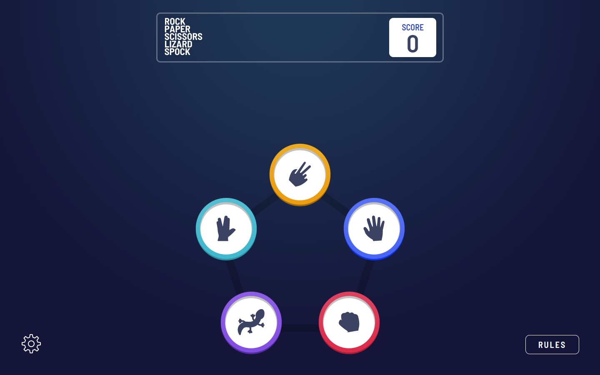
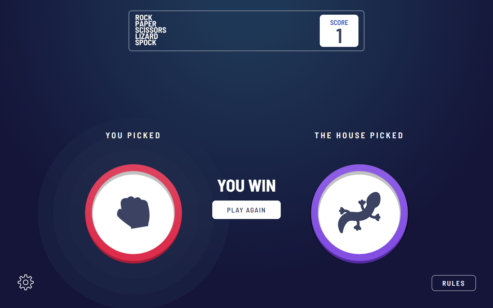
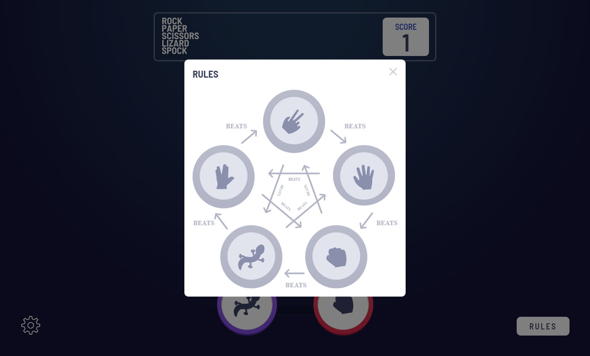
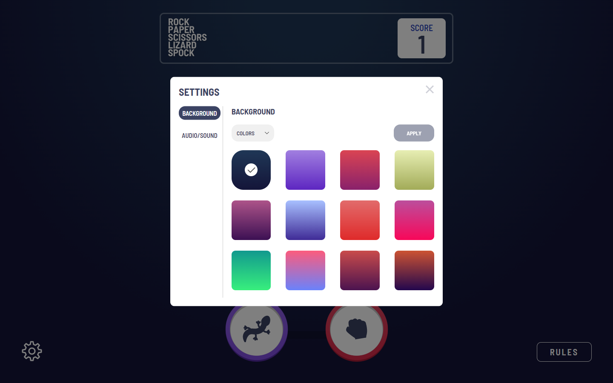

***Tablet Layout*** (768 x 1024)\
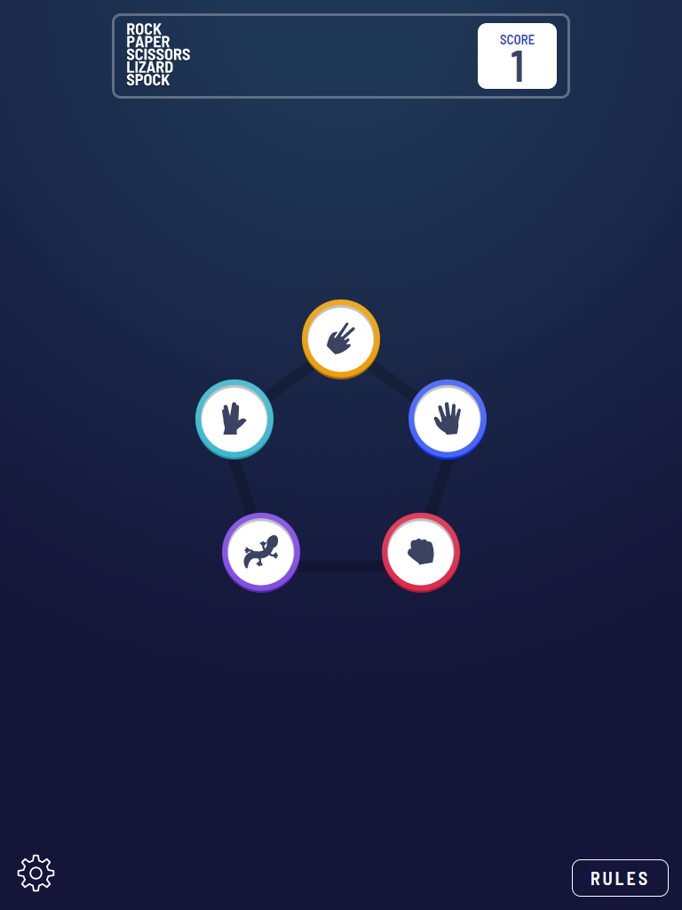
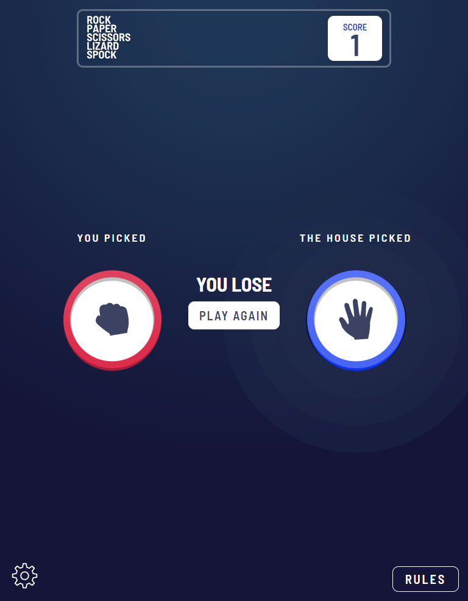
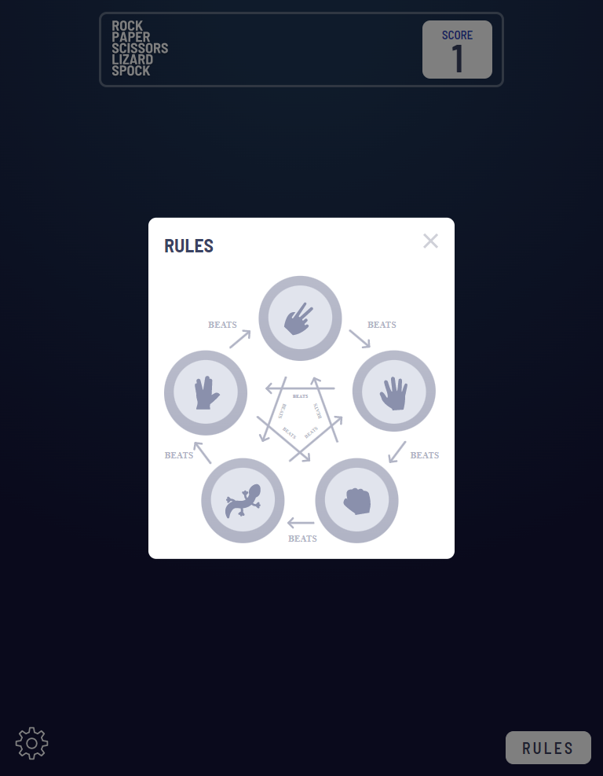
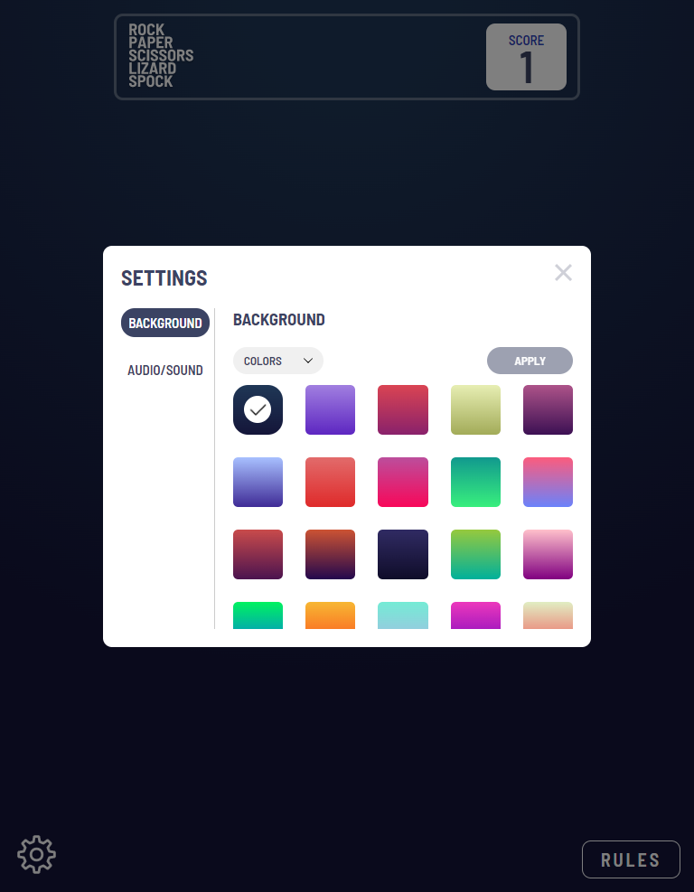

***Mobile Layout*** (375 x 667) \
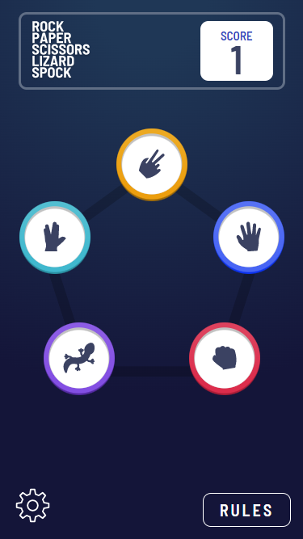
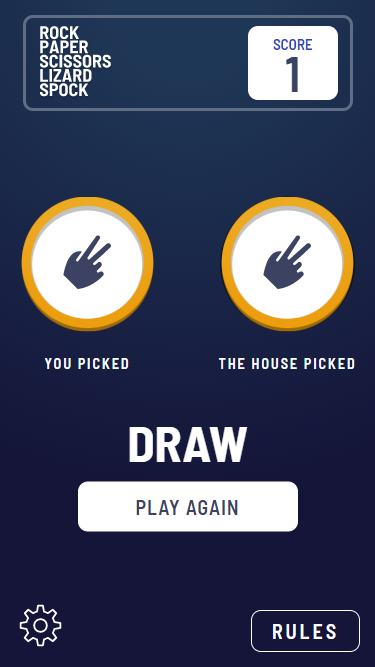
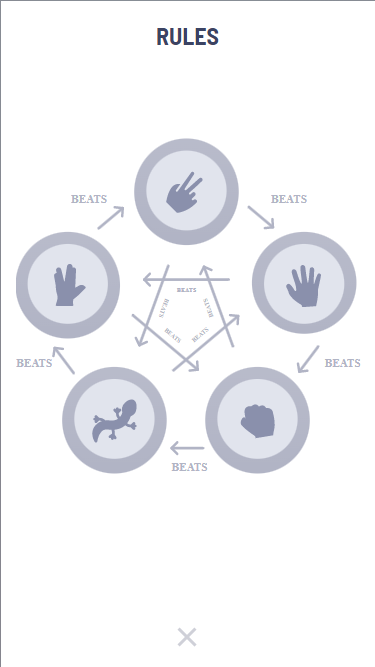
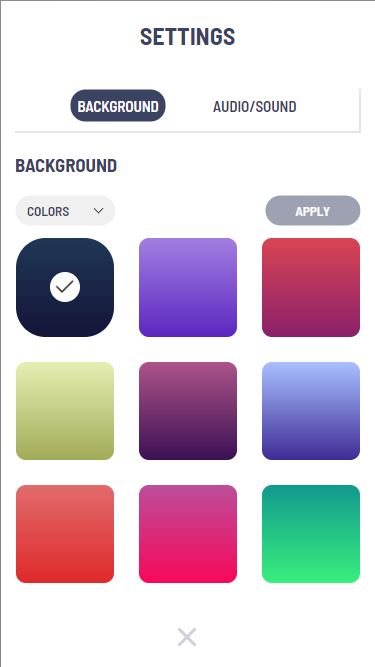

### Links

- Solution URL: [Github Respository](https://github.com/jordan-na/country-search-api-single-page.git)
- Live Site URL: [Hosted on Github Pages](https://jordan-na.github.io/country-search-api-single-page/)

## My process

### Built with

- Semantic HTML5 markup
- CSS custom properties
- Flexbox
- CSS Grid
- Desktop-first workflow
- Vanilla JS
- ES6 module patterns with IIEF's

### What I learned

-  Non-technical skills:

   -  Creating smaller sub goals to finish overall project
   -  Creative design, coming up with a responsive UI that is aesthetically pleasing
   -  Ability to plan and stick to a work schedule with an estimated date of completion
   -  Perserverance to finish the task, even through challenging times
   -  Creating a project not only through the eyes of a developer, but through the eyes of a consumer
      -  Helped me tweak certain features to be mroe user friendly

-  Technical skills:
   -  Responsive UI/UX development
      -  Using the chrome inspector to emulate different screen sizes
   -  Using CSS grid to create responsive and dynamic layouts
   -  CSS media queries
   -  Using LocalStorage API to save user settings/score
   -  Use settings to change game audio and background
   -  Module design patterns to allow code reusability, organization, and readability
      -  *event-handler.mjs*: Responsible for setting up events
      -  *game.mjs*: Responsible for loading app, starting and restarting game, and resetting the game score
      -  *battle.mjs*: Responsible for emulating a game battle and obtaining a result of the battle (winner, loser, etc.)
      -  *move.mjs*: Is a class that reperesents a move object.
         -  A move object has a move type and knows who they win/lose against
         -  move objects are used internally in battle.mjs
      -  *ui-controller.mjs*: Responsible for updating the UI, including showing settings, showing rules, and animating the elements in the game
      -  *settings-controller.mjs*: Responsible for changing the settings in the game
         -  Settings that can be changed include the background color/image, the music type, sfx on/off, and audio volume
         -  Is also reponsible for storing user settings in cache via the LocalStorage API
      -  *bg-controller*: Contains functions to change the background of the game
      -  *audio-controller*: Contains functions to change the audio of the game (music/sfx)
      -  *user-settings.mjs*: Applies the settings that were defined by the user
      -  *string-utils.mjs*: A utility module that provides string methods

### Continued development

-  I will continue to refine my vanilla JS and no-framwork CSS approach before moving onto libraries/frameworks
-  After I have complete a multitude of no library/framework projects, I will learn _React_ and implement it with my knowledge of _Node.js_ and _Express.js_
- Eventually, the goal is to complete a full stack web app that has a use for society

### Useful resources

-  [MDN](https://developer.mozilla.org/en-US/docs/Web/JavaScript) - This helped me by acting as a reference for the built in js API
-  [Local Storage API](https://developer.mozilla.org/en-US/docs/Web/API/Window/localStorage) - I referred to the documentation to use the Local Storage API

## Author

-  Name: Jordan Na
-  Website - [Github Profile](https://github.com/jordan-na)
-  Frontend Mentor - [@jordan-na](https://www.frontendmentor.io/profile/jordan-na)
-  Email - jordster02@gmail.com